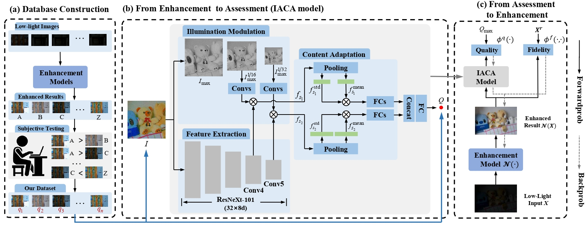

# IACA_For_Lowlight_IQA
Code for "Gap-closing Matters: Perceptual Quality Evaluation and  Optimization of Low-Light Image Enhancement"  
  



# Environment
* Python 3.6.7
* Pytorch 1.6.0  Cuda V9.0.176 Cudnn 7.4.1

# Running
* Download the SQUARE-LOL dataset from [MEGA](https://mega.nz/folder/zSJCETyS#tkiRycyKE9p_8IYeqY_gwA), and put all the downloaded files in the path: "./datasets/SQUARE-LOL/".
* Download the pre-trained models from [MEGA](https://mega.nz/folder/uW4SkaDb#enjhde7PU0YHzYxn8O4ZIg), and put all the downloaded files in the path: "./codes/TMM2023-IACA-Release/checkpoints/".

* Train:  
  `python  ./codes/TMM2023-IACA-Release/IQA_Main.py`

* Test:  
  `python   ./codes/TMM2023-IACA-Release/IQA_Test.py`
    
* Demo:    
   `python   ./codes/TMM2023-IACA-Release/Demo.py`
   
# Details
* Apex install:
```
  git clone https://github.com/NVIDIA/apex
  cd apex
  python3 setup.py install
```
* The original low-light images are also provided in [MEGA](https://mega.nz/folder/zSJCETyS#tkiRycyKE9p_8IYeqY_gwA/file/6eICQB6Y)

