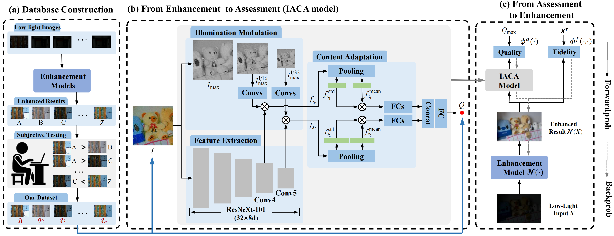

# IACA_For_Lowlight_IQA
Code for "Gap-closing Matters: Perceptual Quality Evaluation and  Optimization of Low-Light Image Enhancement"

# Environment
* Python 3.6.7
* Pytorch 1.6.0  Cuda V9.0.176 Cudnn 7.4.1

# Running
* Download the SQUARE-LOL dataset from [MEGA](https://pan.baidu.com/s/1pyl5Yz4opPdoACnqSWLXsw), and put all the downloaded files in the path: "./datasets/SQUARE-LOL/".

* Train:  
  `python  ./GSTVQA/TCSVT_Release/GVQA_Release/GVQA_Cross/main.py --TrainIndex=1  
  (TrainIndex=1：using the CVD2014 datase as source dataset; 2: LIVE-Qua; 3: LIVE-VQC; 4: KoNviD）`

* Test:  
  `python  ./GSTVQA/TCSVT_Release/GVQA_Release/GVQA_Cross/cross_test.py --TrainIndex=1  
  （TrainIndex=1：using the CVD2014 datase as source dataset; 2: LIVE-Qua; 3: LIVE-VQC; 4: KoNviD）`  

# Details
* Waitting

